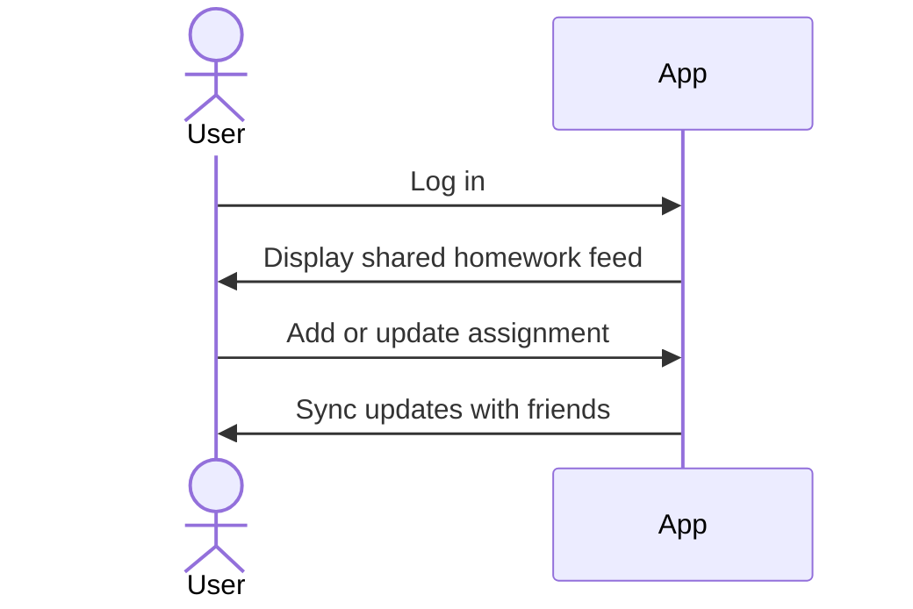

# Your startup name here

[My Notes](notes.md)

Homework Together is a social homework tracker that lets friends and classmates see upcoming assignments, share progress, and stay accountable together. Instead of juggling multiple planners and apps, everything lives in one shared, social space designed for how students actually work.

> [!NOTE]
> This is a template for your startup application. You must modify this `README.md` file for each phase of your development. You only need to fill in the section for each deliverable when that deliverable is submitted in Canvas. Without completing the section for a deliverable, the TA will not know what to look for when grading your submission. Feel free to add additional information to each deliverable description, but make sure you at least have the list of rubric items and a description of what you did for each item.

> [!NOTE]
> If you are not familiar with Markdown then you should review the [documentation](https://docs.github.com/en/get-started/writing-on-github/getting-started-with-writing-and-formatting-on-github/basic-writing-and-formatting-syntax) before continuing.

## 🚀 Specification Deliverable

> [!NOTE]
> Fill in this sections as the submission artifact for this deliverable. You can refer to this [example](https://github.com/webprogramming260/startup-example/blob/main/README.md) for inspiration.

For this deliverable I did the following. I checked the box `[x]` and added a description for things I completed.

- [x] Proper use of Markdown
- [x] A concise and compelling elevator pitch
- [x] Description of key features
- [x] Description of how you will use each technology
- [x] One or more rough sketches of your application. Images must be embedded in this file using Markdown image references.

### Elevator pitch

Imagine a social feed, but instead of posts and likes, it’s homework deadlines, study plans, and shared progress. Our platform lets you and your friends track assignments together in one place—see what’s due, who’s working on what, and when it’s time to grind. By turning homework into a shared, social experience, we reduce procrastination, increase accountability, and make studying feel less isolating. It’s not another planner—it’s a homework network built for how students actually work together.

### Design

The application is designed around a shared homework feed that feels similar to a social media timeline. After logging in, users see an organized schedule of assignments imported from Learning Suite, sorted by due date. Friends’ activity (studying, completing assignments) appears alongside the schedule to promote accountability and collaboration. Users can interact with assignments by marking progress, starting study sessions, or completing tasks.

### Key features

- Import and organize assignments from Learning Suite into a single, clear schedule
- Social homework feed showing friends’ study activity and completed assignments
- Interactive assignment tracking (not started, studying, completed)
- Real-time updates so friends can see progress instantly

### Technologies

I am going to use the required technologies in the following ways.

- **HTML** - Structure the core pages of the site, including login, homework dashboard, and social feed layout.
- **CSS** - Style the application to resemble a modern social media platform, with a clean design
- **React** - Build reusable components for assignments, feeds, and friend activity, and manage dynamic state as users interact with the app.
- **Service** - Provide backend endpoints for importing assignments, updating progress, and managing social interactions as well as login information to maintain account information
- **DB/Login** - Store user accounts, assignments, and friend relationships securely, with authentication to ensure private data stays protected.
- **WebSocket** - Enable real-time updates so when a user starts studying or completes an assignment, their friends see it immediately.

## 🚀 AWS deliverable

For this deliverable I did the following. I checked the box `[x]` and added a description for things I completed.

- [x] **Server deployed and accessible with custom domain name** - [My server link](https://sociallearning.click/).

## 🚀 HTML deliverable

For this deliverable I did the following. I checked the box `[x]` and added a description for things I completed.

- [x] **HTML pages** - I am using 4 seperate HTML pages one is feed.html for the social network part, index.html to login, home.html as sort of a dashboard, toDO.html to see what you need to do going forward.
- [x] **Proper HTML element usage** - I am using headers and footers as well as taking advantage of the style section with backgrounds and whatnot. I eventually reverted and connected to a CSS style sheet for future deliverables
- [x] **Links** - I linked my 4 html pages across the website so you can navigate between pages.
- [x] **Text** - Instruction in places to help guide user as well as place holders.
- [x] **3rd party API placeholder** - (Place holder with commented out intention) there is a section in the feed that will generate study tips for those in the feed.
- [x] **Images** - I do have image place holders that will eventually be a logo that I will create myself for the headers of the pages
- [x] **Login placeholder** - I completed this even including regex logic for valid emails.
- [x] **DB data placeholder** - This is found on the ToDo list with a database call for assignments as well as a possible database call to assignments that your friends want you to see.
- [x] **WebSocket placeholder** - Live updates for the social media part of social learning where posts and updates can be seen live.

## 🚀 CSS deliverable

For this deliverable I did the following. I checked the box `[x]` and added a description for things I completed.

- [x] **Visually appealing colors and layout. No overflowing elements.** - I completed this with nice dark color scheme (might change) with no overflowing elements
- [x] **Use of a CSS framework** - have a styles sheet that uses the css framework for different areas of my website
- [ ] **All visual elements styled using CSS** - I did not complete this part of the deliverable.
- [ ] **Responsive to window resizing using flexbox and/or grid display** - I did not complete this part of the deliverable.
- [ ] **Use of a imported font** - I did not complete this part of the deliverable.
- [ ] **Use of different types of selectors including element, class, ID, and pseudo selectors** - I did not complete this part of the deliverable.

## 🚀 React part 1: Routing deliverable

For this deliverable I did the following. I checked the box `[x]` and added a description for things I completed.

- [ ] **Bundled using Vite** - I did not complete this part of the deliverable.
- [ ] **Components** - I did not complete this part of the deliverable.
- [ ] **Router** - I did not complete this part of the deliverable.

## 🚀 React part 2: Reactivity deliverable

For this deliverable I did the following. I checked the box `[x]` and added a description for things I completed.

- [ ] **All functionality implemented or mocked out** - I did not complete this part of the deliverable.
- [ ] **Hooks** - I did not complete this part of the deliverable.

## 🚀 Service deliverable

For this deliverable I did the following. I checked the box `[x]` and added a description for things I completed.

- [ ] **Node.js/Express HTTP service** - I did not complete this part of the deliverable.
- [ ] **Static middleware for frontend** - I did not complete this part of the deliverable.
- [ ] **Calls to third party endpoints** - I did not complete this part of the deliverable.
- [ ] **Backend service endpoints** - I did not complete this part of the deliverable.
- [ ] **Frontend calls service endpoints** - I did not complete this part of the deliverable.
- [ ] **Supports registration, login, logout, and restricted endpoint** - I did not complete this part of the deliverable.

## 🚀 DB deliverable

For this deliverable I did the following. I checked the box `[x]` and added a description for things I completed.

- [ ] **Stores data in MongoDB** - I did not complete this part of the deliverable.
- [ ] **Stores credentials in MongoDB** - I did not complete this part of the deliverable.

## 🚀 WebSocket deliverable

For this deliverable I did the following. I checked the box `[x]` and added a description for things I completed.

- [ ] **Backend listens for WebSocket connection** - I did not complete this part of the deliverable.
- [ ] **Frontend makes WebSocket connection** - I did not complete this part of the deliverable.
- [ ] **Data sent over WebSocket connection** - I did not complete this part of the deliverable.
- [ ] **WebSocket data displayed** - I did not complete this part of the deliverable.
- [ ] **Application is fully functional** - I did not complete this part of the deliverable.
