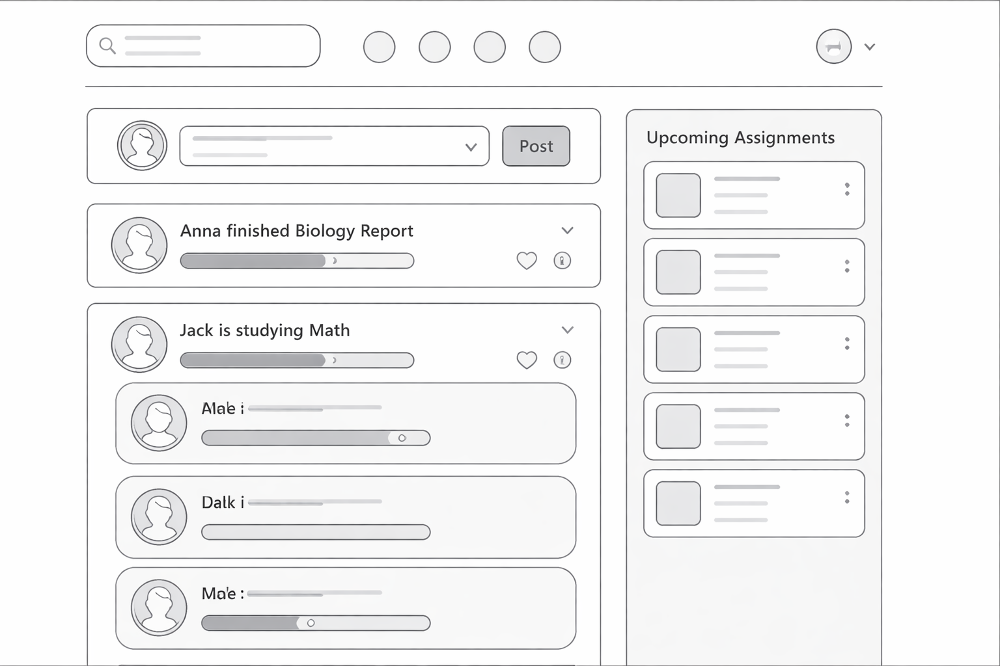
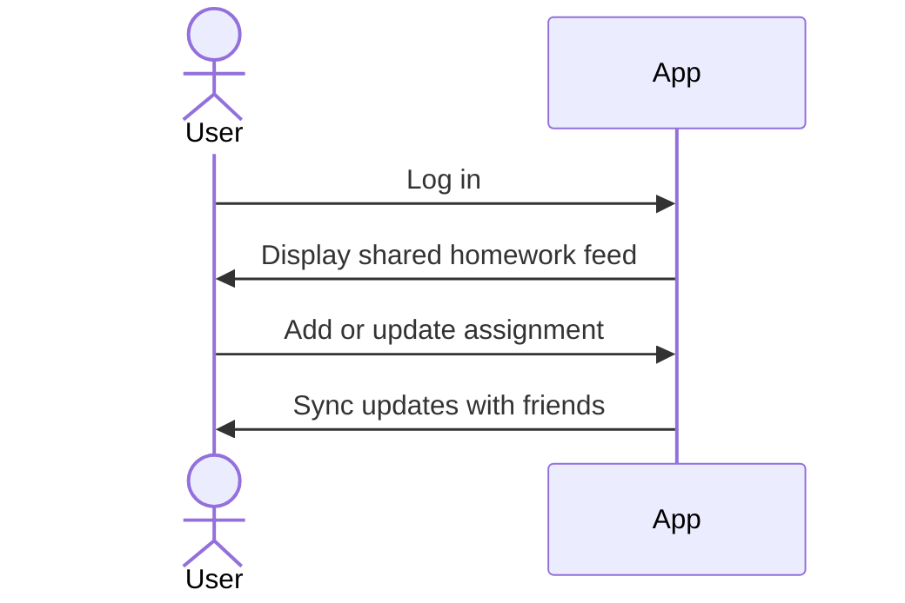

# Your startup name here

[My Notes](notes.md)

Homework Together is a social homework tracker that lets friends and classmates see upcoming assignments, share progress, and stay accountable together. Instead of juggling multiple planners and apps, everything lives in one shared, social space designed for how students actually work.

> [!NOTE]
> This is a template for your startup application. You must modify this `README.md` file for each phase of your development. You only need to fill in the section for each deliverable when that deliverable is submitted in Canvas. Without completing the section for a deliverable, the TA will not know what to look for when grading your submission. Feel free to add additional information to each deliverable description, but make sure you at least have the list of rubric items and a description of what you did for each item.

> [!NOTE]
> If you are not familiar with Markdown then you should review the [documentation](https://docs.github.com/en/get-started/writing-on-github/getting-started-with-writing-and-formatting-on-github/basic-writing-and-formatting-syntax) before continuing.

## 🚀 Specification Deliverable

> [!NOTE]
> Fill in this sections as the submission artifact for this deliverable. You can refer to this [example](https://github.com/webprogramming260/startup-example/blob/main/README.md) for inspiration.

For this deliverable I did the following. I checked the box `[x]` and added a description for things I completed.

- [x] Proper use of Markdown
- [x] A concise and compelling elevator pitch
- [x] Description of key features
- [x] Description of how you will use each technology
- [x] One or more rough sketches of your application. Images must be embedded in this file using Markdown image references.

### Elevator pitch

Imagine a social feed, but instead of posts and likes, it’s homework deadlines, study plans, and shared progress. Our platform lets you and your friends track assignments together in one place—see what’s due, who’s working on what, and when it’s time to grind. By turning homework into a shared, social experience, we reduce procrastination, increase accountability, and make studying feel less isolating. It’s not another planner—it’s a homework network built for how students actually work together.

### Design

The application is designed around a shared homework feed that feels similar to a social media timeline. After logging in, users see an organized schedule of assignments imported from Learning Suite, sorted by due date. Friends’ activity (studying, completing assignments) appears alongside the schedule to promote accountability and collaboration. Users can interact with assignments by marking progress, starting study sessions, or completing tasks.

```mermaid
sequenceDiagram
    actor User
    participant App
    User->>App: Log in
    App->>User: Display shared homework feed
    User->>App: Add or update assignment
    App->>User: Sync updates with friends
```

### Key features

- Import and organize assignments from Learning Suite into a single, clear schedule
- Social homework feed showing friends’ study activity and completed assignments
- Interactive assignment tracking (not started, studying, completed)
- Real-time updates so friends can see progress instantly

### Technologies

I am going to use the required technologies in the following ways.

- **HTML** - Structure the core pages of the site, including login, homework dashboard, and social feed layout.
- **CSS** - Style the application to resemble a modern social media platform, with a clean design
- **React** - Build reusable components for assignments, feeds, and friend activity, and manage dynamic state as users interact with the app.
- **Service** - Provide backend endpoints for importing assignments, updating progress, and managing social interactions as well as login information to maintain account information
- **DB/Login** - Store user accounts, assignments, and friend relationships securely, with authentication to ensure private data stays protected.
- **WebSocket** - Enable real-time updates so when a user starts studying or completes an assignment, their friends see it immediately.

## 🚀 AWS deliverable

For this deliverable I did the following. I checked the box `[x]` and added a description for things I completed.

- [x] **Server deployed and accessible with custom domain name** - [My server link](https://sociallearning.click/).

## 🚀 HTML deliverable

For this deliverable I did the following. I checked the box `[x]` and added a description for things I completed.

- [x] **HTML pages** - I am using 4 seperate HTML pages one is feed.html for the social network part, index.html to login, home.html as sort of a dashboard, toDO.html to see what you need to do going forward.
- [x] **Proper HTML element usage** - I am using headers and footers as well as taking advantage of the style section with backgrounds and whatnot. I eventually reverted and connected to a CSS style sheet for future deliverables
- [x] **Links** - I linked my 4 html pages across the website so you can navigate between pages.
- [x] **Text** - Instruction in places to help guide user as well as place holders.
- [x] **3rd party API placeholder** - (Place holder with commented out intention) there is a section in the feed that will generate study tips for those in the feed.
- [x] **Images** - I do have image place holders that will eventually be a logo that I will create myself for the headers of the pages
- [x] **Login placeholder** - I completed this even including regex logic for valid emails.
- [x] **DB data placeholder** - This is found on the ToDo list with a database call for assignments as well as a possible database call to assignments that your friends want you to see.
- [x] **WebSocket placeholder** - Live updates for the social media part of social learning where posts and updates can be seen live.

## 🚀 CSS deliverable

For this deliverable I did the following. I checked the box `[x]` and added a description for things I completed.

- [x] **Visually appealing colors and layout. No overflowing elements.** - I completed this with nice dark color scheme (might change) with no overflowing elements
- [x] **Use of a CSS framework** - have a styles sheet that uses the css framework for different areas of my website
- [x] **All visual elements styled using CSS** - There are visually appealing buttons, cards, top bar movement, etc. that are all used with CSS
- [x] **Responsive to window resizing using flexbox and/or grid display** - I used flex on the css styles sheet and now it resizes and even stacks once the window gets too thin
- [x] **Use of a imported font** - I imported a font from google for my title
- [x] **Use of different types of selectors including element, class, ID, and pseudo selectors** - I used element selectors, class selectors, ID selectors, and pseudo-selectors (such as :hover, :focus, and ::before) throughout my CSS to style elements and handle interactions.

## 🚀 React part 1: Routing deliverable

For this deliverable I did the following. I checked the box `[x]` and added a description for things I completed.

- [x] **Bundled using Vite** - I configured Vite and used it to bundle the React application into an optimized production build for deployment.
- [x] **Components** - I converted the original HTML pages into modular React function components, with shared layout handled by a top-level App component.
- [x] **Router** - I implemented client-side routing using react-router-dom, replacing page navigation with routes and Link/NavLink components instead of using .html pages from before.

## 🚀 React part 2: Reactivity deliverable

For this deliverable I did the following. I checked the box `[x]` and added a description for things I completed.

- [x] **All functionality implemented or mocked out** - I have multiple React components that implement or mock login, registration, logout, home dashboard, feed, and to-do. These come especially in the addition of classes and assigments which are saved within local storage as well as changing the calender. As well as posts that are categorized and saved. The login requires authentication as well and information is stored per user.
- [x] **Hooks** - useState is used for form and UI state in Login (email, password, errors, create-account modal), CreateAccountModal, Feed (post text, category, posts, filter), ToDo (calendar view, modal open flags, classes, selected class, assignments), and all three ToDo modals (form fields). useEffect is used to load/sync data (e.g. Feed posts, ToDo classes and assignments) and to reset/focus modal forms when opened. useMemo is used in Home and ToDo for derived state (e.g. assignment stats, filtered lists).

## 🚀 Service deliverable

For this deliverable I did the following. I checked the box `[x]` and added a description for things I completed.

- [x] **Node.js/Express HTTP service** - Express app in service/index.js, with express.json(), cookie-parser(), and static + API routes. Deploy runs it via npm start in the service directory.
- [x] **Static middleware for frontend** - app.use(express.static('public')) in the service. Deploy script runs npm run build, then copies dist/ to build/public/, so in production Express serves the Vite-built frontend from public/. SPA fallback sends index.html for non-API routes.
- [x] **Calls to third party endpoints** - Feed page calls `https://api.adviceslip.com/advice` with fetch() and displays the result in the "QUOTE BREAK!!" sidebar.
- [x] **Backend service endpoints** - Auth: 'POST /api/auth/create, POST /api/auth/login, DELETE /api/auth/logout, GET /api/user/me. App data: GET/POST /api/tasks, GET/POST /api/classes, GET/POST /api/assignments, DELETE /api/assignments/:id, GET/POST /api/posts. All app endpoints use verifyAuth (cookie-based).
- [x] **Frontend calls service endpoints** - src/api.js sends all requests with credentials: 'include'. AuthContext calls auth endpoints; Home/Feed/ToDo fetch classes, assignments, posts, and tasks from the API. No auth or user data stored in the frontend.
- [x] **Supports registration, login, logout, and restricted endpoint** - Registration: POST /api/auth/create (username, email, password; bcrypt hash, token, cookie). Login: POST /api/auth/login (email, password; bcrypt compare, set cookie). Logout: DELETE /api/auth/logout (clear cookie and token). Restricted: verifyAuth middleware reads cookie, verifies token; tasks, classes, assignments, and posts endpoints require auth and return 401 otherwise.

## 🚀 DB deliverable

For this deliverable I did the following. I checked the box `[x]` and added a description for things I completed.

- [x] **Stores data in MongoDB** - Stores data in MongoDB – The app uses MongoDB Atlas (via the Node driver) to store all data. Connection is set through dbConfig.json or MONGODB_URI. Data is stored in collections like users, classes, assignments, posts, and tasks.
- [x] **Stores credentials in MongoDB** - User data is stored in the users collection, including email, username, hashed password, and a session token. Register creates a user, login sets the token, and logout clears it.

## 🚀 WebSocket deliverable

For this deliverable I did the following. I checked the box `[x]` and added a description for things I completed.

- [x] **Backend listens for WebSocket connection** - I updated the backend service to run Express through an HTTP server and attached a WebSocket server (ws) on /ws. The server authenticates each socket using the same login cookie token used by REST endpoints and rejects unauthenticated connections.
- [x] **Frontend makes WebSocket connection** - The Feed page opens a WebSocket connection to the same host (ws:// in local dev, wss:// in production) and listens for live events. In development, Vite proxies /ws to the backend on port 4000 so the React app and service work together.
- [x] **Data sent over WebSocket connection** - Clients send JSON chat messages (type, text, and category) to the server. The server validates/sanitizes the payload and broadcasts normalized chat events plus presence count updates (users online) to all connected clients.
- [x] **WebSocket data displayed** - Incoming WebSocket data is rendered in the Feed UI in real time. Messages appear as post-style cards with author, category, and relative timestamp, and the UI also shows live connection status and online user count.
- [x] **Application is fully functional** - The application now works as intended allowing users to chat over a text box while updating their schooling info and organizing what needs to get done.
